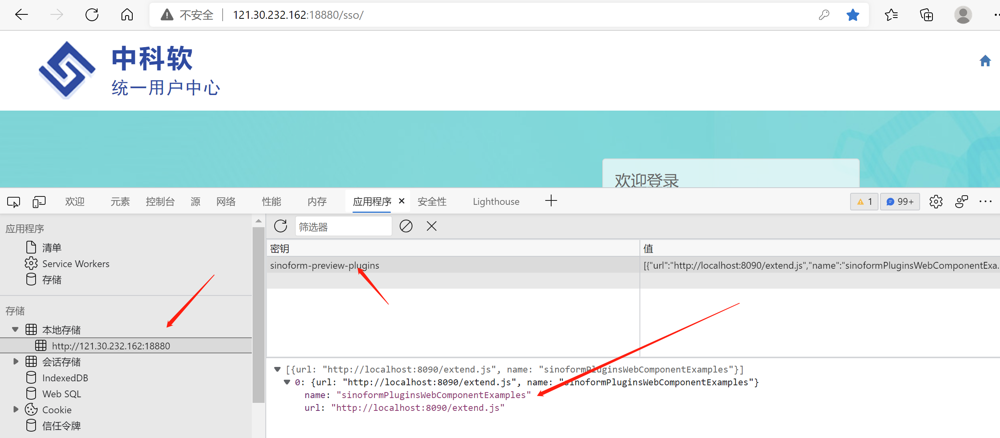
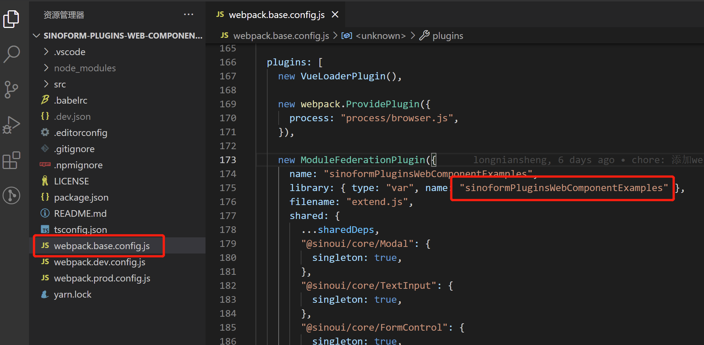

## 1. 在调试智能表单插件时，智能表单页面上不显示相关的插件，如自定义的流程按钮、表单控件等。

出现这种情况，有可能是以下几种情况导致的，请逐一排查：

### 情况一：未注册本地插件项目

要想在智能表单中调试插件项目，需要将插件项目注册到智能表单产品中。注册过程是：在浏览器中先打开智能表单页面，然后打开浏览器的控制台（devtools），在控制台执行下面的代码，完成注册：

```javascript {6}
localStorage.setItem(
  "sinoform-preview-plugins",
  JSON.stringify([
    {
      url: "http://localhost:8090/extend.js",
      name: "qxjoaPlugins",
    },
  ])
);
```

千万要注意 `name`，需要与插件项目名称保持一致（需要将连字符形式的插件项目名称转化为首字母小写的驼峰式名称）。

另外，如果您之前注册过，但是以下行为有可能会取消注册：

- 主动执行 `localStorage.removeItem("sinoform-preview-plugins");` 代码，取消插件项目的注册
- 清空了浏览器的缓存
- 您使用了其他的浏览器打开了智能表单

您可以打开浏览器开发者工具的`application`（`应用程序`）面板中查看一下`localStorage`（`本地存储`），如果有以下类似的内容，则表示注册成功：



### 情况二：注册的插件项目名称错误

有可能您的项目名称与您注册的插件项目名称不一致，您可以打开插件项目的 `webpack.base.config.js` 文件，查看库名称，如下图所示：



可以将上图与情况一中注册的名称对比一下，看一下是否一致。

### 情况三：插件项目未启动

有可能您忘记启动插件项目了。请确认一下。如果没有启动，则执行一下 `yarn start`，启动项目。

### 情况四：您动了 webpack 配置？

如果您调整了 webpack 相关配置，例如 `端口号`，那么您需要重新注册一下插件项目，使用正确的 `url`。

### 情况五：您的插件注册了么？

请打开插件项目入口文件 `src/index.ts`，检查是否注册了相关插件。例如：

注册流程按钮：

```typescript
// 注册 hello-button 插件（流程按钮）
AppSetting.flowConfig.addButton({
  id: "hello-button",
  name: "Hello World",
  render: React.lazy(() => import("./plugins/flow-button-hello")),
});
```

注册表单项：

```typescript
// 注册 custom-text-input 表单控件
AppSetting.formConfig.addField({
  type: "custom-text-input",
  title: "自定义单行文本",
  group: FormFieldGroup.normal,
  icon: EventNote,
  render: React.lazy(
    () => import("./plugins/form-field-custom-text-input/render")
  ),
  preview: React.lazy(
    () => import("./plugins/form-field-custom-text-input/preview")
  ),
  configPanel: React.lazy(
    () => import("./plugins/form-field-custom-text-input/config-panel")
  ),
});
```

注册扩展：

```typescript
import "./plugins/detail-page-extends/customPermissionExtends";
```
