 

# 入门教程

## 环境准备

- jdk1.8 +
- idea企业版
- maven
- postman - 测试用

## 实例下载

以下教程的springboot项目：https://gitee.com/sinoui/sinoform-plugin.git

## 初始化一个springboot项目

如果已有springboot项目，跳过该步骤。

- 打开idea，新建springboot项目

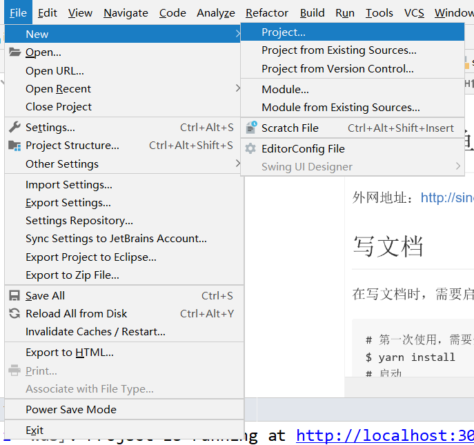

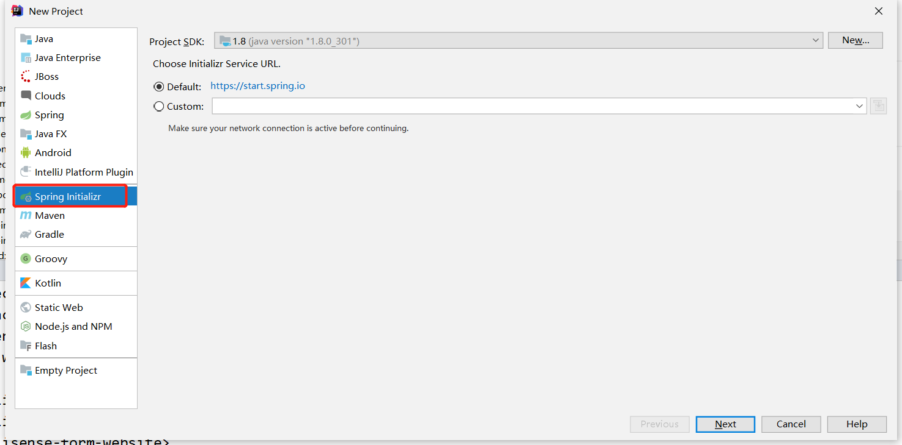

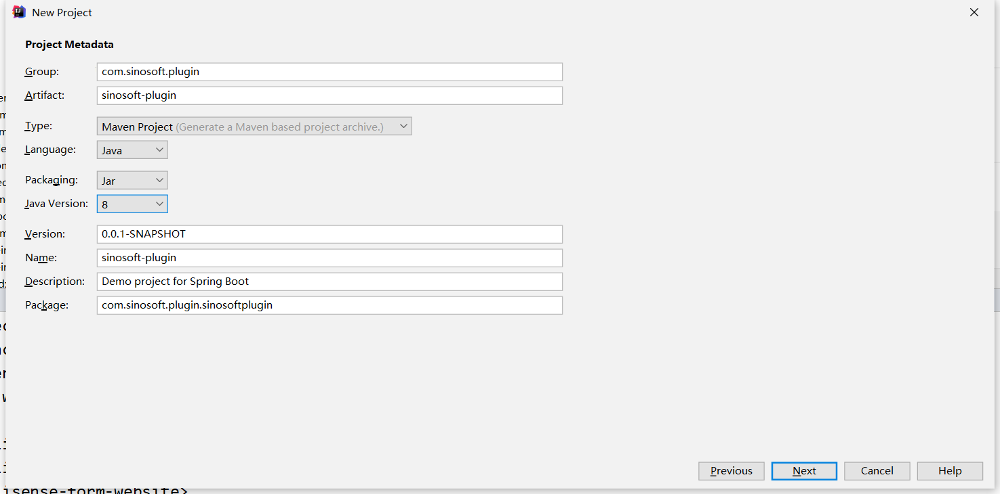

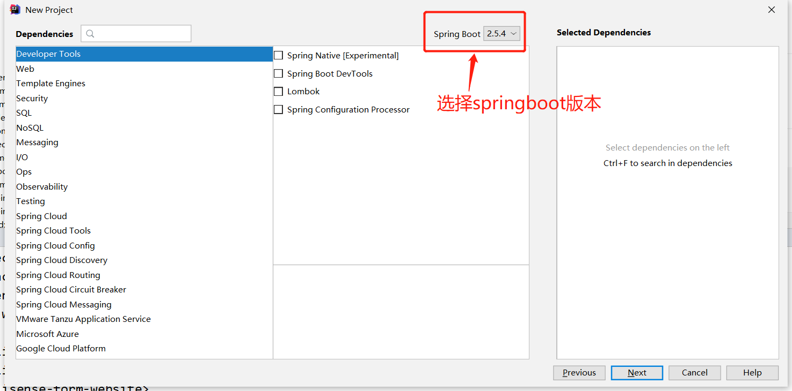

## 开发第一个事件订阅方法

### 引入sinoform-sdk.jar工具包。
~~~xml
<dependency>
    <groupId>com.sinosoft</groupId>
    <artifactId>sinoform-sdk</artifactId>
    <version>1.12.0-alpha.0</version>
</dependency>
~~~

### 配置application.yml

在springboot核心配置文件application.yml中增加以下配置信息：

~~~yaml
server:
  port: 8081
sinoform:
  event:
    server:
      #智能表单服务的ip和端口，用于向服务端订阅事件，可配置多个以“,”分割，端口需要与ip地址一一对应
      ip: 192.168.90.92
      port: 8080
    client:
      #当前项目的分组，可自定义分组名称，同一分组多个项目若订阅了相同的事件，那么只会发布给其中一个项目
      group: meeting
      #当前项目服务的端口，可选配置项，用于接收智能表单发布的事件，默认为server.port
      port: 8081
~~~

### 创建事件订阅类

- 订阅类需要加@Compment注解，订阅类也可以是service或controller类
- 事件订阅方法需要加@RemoteEventSubscribe注解
- 事件订阅方法参数为需要监听的事件对象，只能有一个参数
- 目前支持两种事件的订阅FlowEndEvent和FlowSendEvent
- 代码如下：

~~~java
package com.sinosoft.plugin.sinosoftplugin;

import com.sinosoft.sdk.annotation.RemoteEventSubscribe;
import com.sinosoft.sdk.event.FlowEndEvent;
import org.springframework.stereotype.Component;

@Component
public class FirstSubscriber {

    @RemoteEventSubscribe
    public void helloEvent(FlowEndEvent event) {
        System.out.println("Hello event : " + event.toString());
    }
}

~~~

### 启动项目

启动项目，可以看到以下输出，说明已经订阅了智能表单服务的事件，其中/sinoform/client/apis/post是默认的当前项目的发布接口，sinoform-sdk会根据接收到的事件信息自动转换事件对象，并调用订阅了该事件的方法。

~~~
智能表单服务地址 : [http://192.168.90.92:8080/sinoform/server/apis/registerEventListener]
当前项目的事件发布URL : /sinoform/client/apis/post
订阅事件数量 : 3
订阅事件列表 : 
        com.sinosoft.plugin.sinosoftplugin.FirstSubscriber.helloEvent(com.sinosoft.sdk.event.FlowEndEvent)
开始订阅 : 
        订阅请求：{"eventListeners":......}
        向智能表单服务 http://192.168.90.92:8080/sinoform/server/apis/registerEventListener 订阅成功. ok

~~~

<h2 id="测试事件发布"></h2>

### 测试事件发布

智能表单服务端提供了测试接口，使用postman调用测试接口进行事件发布的测试

- 测试接口 ： http://192.168.90.92:8080/sinoform/server/apis/testPostEvent
- 请求类型 ： post
- body格式 ：form-data
- 接口参数 ： key : eventName     value(事件对象的包名+类名) : com.sinosoft.sdk.event.FlowEndEvent
- 如下图：

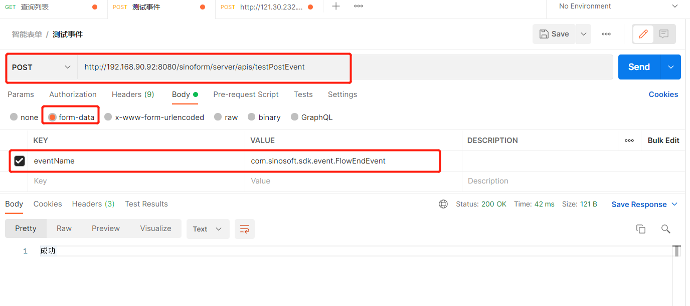

- 查看idea控制台输出，如下：

~~~
Hello event : WorkFlowEvent(......)
~~~

## 订阅多个事件实例

### 创建事件订阅类

- 在同一个类中添加多个订阅方法，代码如下：

  ~~~java
  package com.sinosoft.plugin.sinosoftplugin;
  
  import com.sinosoft.sdk.annotation.RemoteEventSubscribe;
  import com.sinosoft.sdk.event.FlowEndEvent;
  import com.sinosoft.sdk.event.FlowSendEvent;
  import org.springframework.stereotype.Component;
  
  @Component
  public class ManySubscriber {
  
      @RemoteEventSubscribe
      public void helloFlowSendEvent(FlowSendEvent event) {
          System.out.println("Test 1 : Hello FlowSendEvent : " + event);
      }
  
      @RemoteEventSubscribe
      public void helloFlowEndEvent(FlowEndEvent event) {
          System.out.println("Test 2 :Hello FlowEndEvent : " + event);
      }
  }
  
  ~~~

### 启动项目

启动项目，可以看到以下输出，订阅事件列表中有三条记录，在FirstSubscriber类中找到了一个订阅方法，在ManySubscriber中找到了两个订阅方法，并订阅成功。

~~~
智能表单服务地址 : [http://192.168.90.92:8080/sinoform/server/apis/registerEventListener]
当前项目的事件发布URL : /sinoform/client/apis/post
订阅事件数量 : 3
订阅事件列表 : 
        com.sinosoft.plugin.sinosoftplugin.FirstSubscriber.helloEvent(com.sinosoft.sdk.event.FlowEndEvent)
        com.sinosoft.plugin.sinosoftplugin.ManySubscriber.helloFlowEndEvent(com.sinosoft.sdk.event.FlowEndEvent)
        com.sinosoft.plugin.sinosoftplugin.ManySubscriber.helloFlowSendEvent(com.sinosoft.sdk.event.FlowSendEvent)
开始订阅 : 
        订阅请求：{"eventListeners":......}
        向智能表单服务 http://192.168.90.92:8080/sinoform/server/apis/registerEventListener 订阅成功. ok
~~~

### 测试事件发布

使用postman调用测试事件发布接口，分别发布事件com.sinosoft.sdk.event.FlowEndEvent 和 com.sinosoft.sdk.event.FlowSendEvent，查看当前项目输出。（[测试接口调用说明](#测试事件发布)）

发布FlowSendEvent的输出为：

~~~
Test 1 : Hello FlowSendEvent : WorkFlowEvent(...)
~~~

发布FlowEndEvent的输出为：

~~~
Hello event : WorkFlowEvent(...)
Test 2 : Hello FlowEndEvent : WorkFlowEvent(...)
~~~

### 总结

- 在sinoform-sdk提供的订阅机制中，订阅方法可以有多个，这些订阅方法可以在相同的类中，也可以在不同的类中。

## 多个智能表单服务的订阅实例

### 配置application.yml

在sinoform.event.server.ip中配置多个ip地址，其中实际可用的ip为121.30.232.162，配置如下：

~~~yml
server:
  port: 8081
sinoform:
  event:
    server:
      #智能表单服务的ip和端口，用于向服务端订阅事件，可配置多个以“,”分割，端口需要与ip地址一一对应
      ip: 10.200.100.1,10.200.100.2,192.168.90.92,10.200.100.3,10.200.100.34
      port: 8080
    client:
      #当前项目的分组，可自定义分组名称，同一分组多个项目若订阅了相同的事件，那么只会发布给其中一个项目
      group: meeting
      #当前项目服务的端口，可选配置项，用于接收智能表单发布的事件，默认为server.port
      port: 8081
~~~

### 启动项目

启动项目，可以看到以下输出，在订阅失败后，会依次尝试向其他的智能表单服务订阅，直到订阅成功。

~~~
智能表单服务地址 : [http://10.200.100.1:8080/sinoform/server/apis/registerEventListener, http://10.200.100.2:8080/sinoform/server/apis/registerEventListener, http://192.168.90.92:8080/sinoform/server/apis/registerEventListener, http://10.200.100.3:8080/sinoform/server/apis/registerEventListener, http://10.200.100.34:8080/sinoform/server/apis/registerEventListener]
当前项目的事件发布URL : /sinoform/client/apis/post
订阅事件数量 : 3
订阅事件列表 : 
        com.sinosoft.plugin.sinosoftplugin.FirstSubscriber.helloEvent(com.sinosoft.sdk.event.FlowEndEvent)
        com.sinosoft.plugin.sinosoftplugin.ManySubscriber.helloFlowSendEvent(com.sinosoft.sdk.event.FlowSendEvent)
        com.sinosoft.plugin.sinosoftplugin.ManySubscriber.helloFlowEndEvent(com.sinosoft.sdk.event.FlowEndEvent)
开始订阅 : 
        订阅请求：{"eventListeners":...}
        向智能表单服务 http://10.200.100.1:8080/sinoform/server/apis/registerEventListener 订阅失败. 错误信息：Connection timed out: connect
        向智能表单服务 http://10.200.100.2:8080/sinoform/server/apis/registerEventListener 订阅失败. 错误信息：Connection timed out: connect
        向智能表单服务 http://192.168.90.92:8080/sinoform/server/apis/registerEventListener 订阅成功. ok
~~~

### 总结

- 当存在多个智能表单服务时，为了确保可以成功订阅事件，需要将所有智能表单服务的ip配置到sinoform.event.server.ip中，在项目启动时，sinoform-sdk会按配置ip地址的先后顺序，依次尝试订阅事件，直到订阅成功为止。

- 当智能表单服务需要停止或重启时，只需要保证有一个智能表单服务启动就不会影响应用程序的事件订阅。

<h2 id="同组订阅实例"></h2>

## 同组订阅实例

### 配置application.yml

~~~yml
server:
  port: 8081
sinoform:
  event:
    server:
      #智能表单服务的ip和端口，用于向服务端订阅事件，可配置多个以“,”分割，端口需要与ip地址一一对应
      ip: 192.168.90.92
      port: 8080
    client:
      #当前项目的分组，可自定义分组名称，同一分组多个项目若订阅了相同的事件，那么只会发布给其中一个项目
      group: meeting
      #当前项目服务的端口，可选配置项，用于接收智能表单发布的事件，默认为server.port
      port: 8081
~~~

### 启动项目

启动项目

### 修改application.yml

修改项目端口配置：

~~~yml
server:
  port: 8082
sinoform:
  event:
    server:
      #智能表单服务的ip和端口，用于向服务端订阅事件，可配置多个以“,”分割，端口需要与ip地址一一对应
      ip: 192.168.90.92
      port: 8080
    client:
      #当前项目的分组，可自定义分组名称，同一分组多个项目若订阅了相同的事件，那么只会发布给其中一个项目
      group: meeting
      #当前项目服务的端口，可选配置项，用于接收智能表单发布的事件，默认为server.port
      port: 8082
~~~

### 启动项目

再次启动项目，此时我们已经启动了两个项目，且端口分别为8081和8082

### 测试事件发布

使用postman调用测试事件发布接口，发布事件com.sinosoft.sdk.event.FlowEndEvent，查看当前项目输出。（[测试接口调用说明](#测试事件发布)）

可以看到8081端口的项目收到了事件信息：

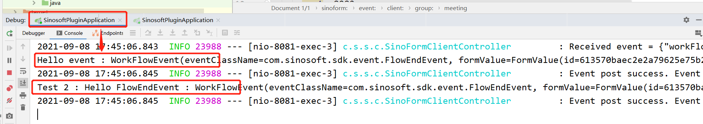

8082端口的项目没有收到事件信息：

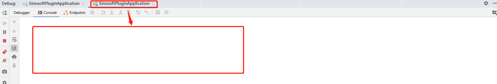

### 总结

- 同一分组的多个项目，若订阅了相同的事件，智能表单服务只会向其中一个项目发布事件。

  

## 多组订阅实例

### 修改application.yml

在[同组订阅实例](#同组订阅实例)的基础上,不要停止项目，再次修改配置，修改当前项目application.yml中的端口信息和分组信息：

~~~yml
server:
  port: 8083
sinoform:
  event:
    server:
      #智能表单服务的ip和端口，用于向服务端订阅事件，可配置多个以“,”分割，端口需要与ip地址一一对应
      ip: 192.168.90.92
      port: 8080
    client:
      #当前项目的分组，可自定义分组名称，同一分组多个项目若订阅了相同的事件，那么只会发布给其中一个项目
      group: email
      #当前项目服务的端口，可选配置项，用于接收智能表单发布的事件，默认为server.port
      port: 8083
~~~

### 启动项目

启动项目

### 修改application.yml

再次修改配置，将当前项目application.yml中的端口信息：

~~~yml
server:
  port: 8084
sinoform:
  event:
    server:
      #智能表单服务的ip和端口，用于向服务端订阅事件，可配置多个以“,”分割，端口需要与ip地址一一对应
      ip: 192.168.90.92
      port: 8080
    client:
      #当前项目的分组，可自定义分组名称，同一分组多个项目若订阅了相同的事件，那么只会发布给其中一个项目
      group: email
      #当前项目服务的端口，可选配置项，用于接收智能表单发布的事件，默认为server.port
      port: 8084
~~~

### 启动项目

再次启动项目，此时我们已经启动了4个项目，且端口分别为8081、8082、8083、8084，其前两次启动配置的8081、8082端口都属于meeting组，而8083、8084属于email组。

### 测试事件发布

使用postman调用测试事件发布接口，发布事件com.sinosoft.sdk.event.FlowEndEvent，查看当前项目输出。（[测试接口调用说明](#测试事件发布)）

可以看到8081端口的项目收到了事件信息，属于meeting分组

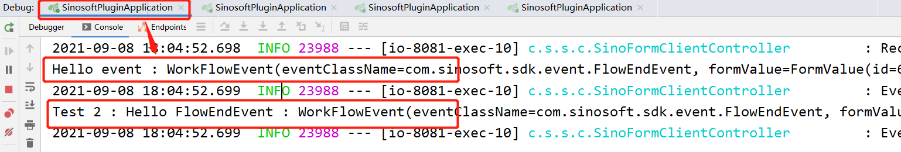

8082端口的项目没有收到事件信息，属于meeting分组

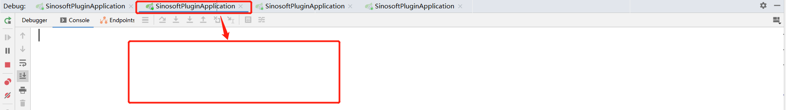

8083端口的项目收到了事件信息，属于email分组

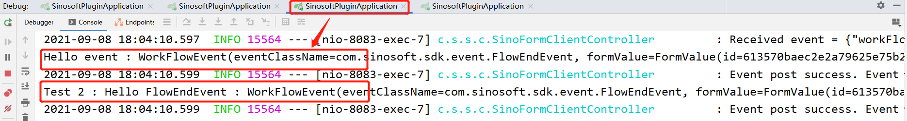

8084端口的项目没有收到事件信息，属于email分组

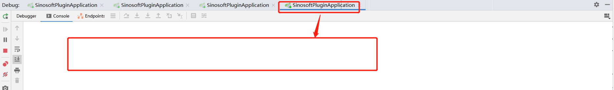

### 总结

- 存在多个分组时，智能表单服务会在每个组中选择一个项目进行事件发布。

