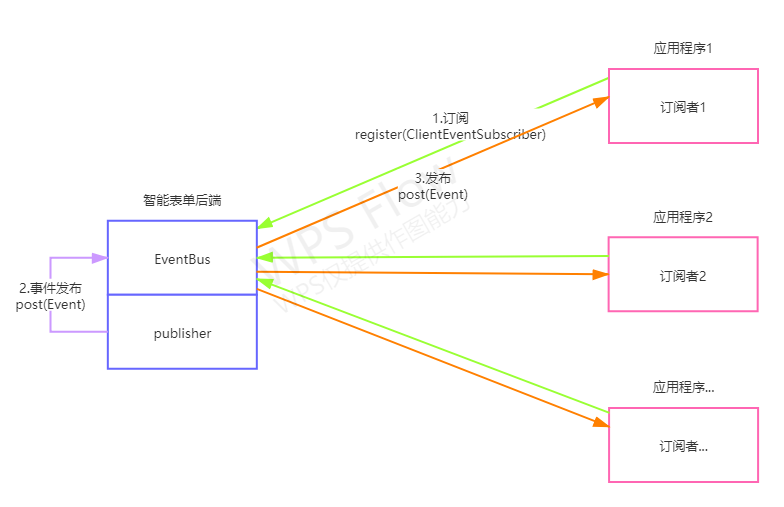

 

# 开篇

## 背景

在使用智能表单服务的过程中，用户往往存在各种各样的定制化业务需求，如：某个流程结束需要向流程发起人发送短信、某个流程的流转记录需要实时同步到其他系统等操作，这就需要智能表单提供强大的扩展机制，方便用户在智能表单服务的基础上进行二次开发，从而满足不同系统的多样的业务需求。

## 目标

智能表单将为开发者提供简单易懂的扩展机制，轻量的开发工具包，方便开发者快速的实现对智能表单的扩展。

## 事件扩展机制

智能表单提供了事件总线服务，在工作流流转过程中，智能表单服务将发布一些工作流相关的事件，目前提供了流程流转事件、流程结束事件。开发者需要向智能表单订阅事件，才能在事件发布时获取到事件数据，我们为开发者准备了sinoform-sdk开发工具包，通过简单的开发即能实现事件的订阅。事件的订阅与发布过程可以参考下图：

## sinoform-sdk对事件扩展的支持

sinoform-sdk是智能表单提供的开发工具包，提供了方法级的事件订阅注解，开发者只需要简单的配置，它就可以提供自动化的事件订阅服务，当有事件发布时，它可以根据事件订阅注解找到对应的方法，传入事件数据并执行，开发者只需要关注需要订阅的事件类型和业务逻辑。

##  

##  

