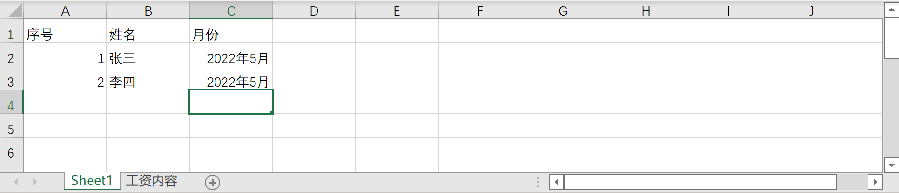
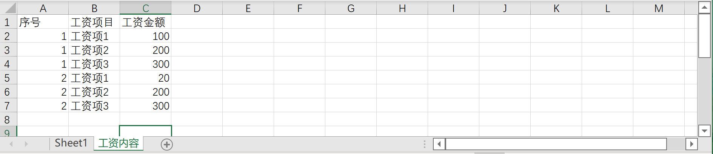
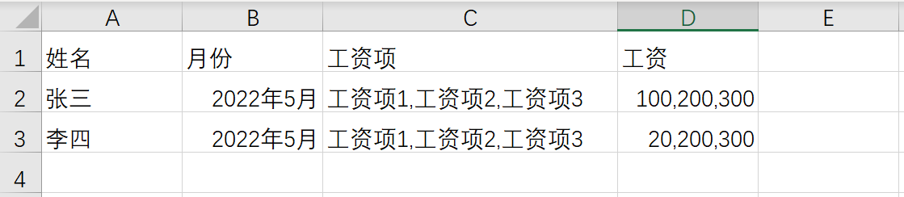
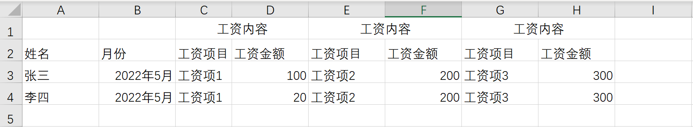

业务数据导入功能是通过读取 excel 文件来批量生成或更新表单数据。`@sinoform/helper-import-excel`模块提供了一整套 excel 解析、数据处理、业务数据导入的功能。

下面我们先了解一下`@sinoform/helper-import-excel`模块的方法，然后分几个场景来演示如何导入业务数据。

## @sinoform/helper-import-excel 模块

`@sinoform/helper-import-excel` 模块提供了`parseImportExcel`、`transformExcelColumns`、`importDataList`几个方法来分别实现 excel 解析、数据处理、业务数据导入的功能。

### parseImportExcel

解析 excel 并生成`dataList`（列表数据）和`columns`（表头信息）。此方法接受如下几个参数：

- file。 要解析的 Excel 文件，文件 Blob 对象
- formDesign。 表单设计配置信息。excel 解析是通过表头与表单项配置中的 title 对应来匹配该列是什么字段
- isDataInOneSheet。 主表单和子表单数据是否在一个 sheet 页中。默认为 true
- titleRow。 主表单所在 sheet 页中的标题所在行。默认为 1（excel 中第一行为 1）

此方法可以处理 [excel-解析场景](#excel-解析场景) 中的 excel 数据，并通过 isDataInOneSheet 来判断应该来使用何种方式来解析数据。其中场景一 isDataInOneSheet 为 false，其余的两个场景均为 true

### transformExcelColumns

将 dataList 中的标题转换成 fieldName，返回处理后的 dataList。

此方法接受两个参数：

- dataList。 列表数据
- columns。 标题配置

### importDataList

批量导入处理后的 excel 数据，如果表单数据中存在 id，则更新对应的表单值，否则新建表单。

此方法接受如下参数：

- dataList。 Excel 解析后的数据列表
- columns。 列表的表头
- formDesign。 表单设计
- currentUser。 当前登录人

通过上述方法说明，我们可以发现这其实是将导入的三个步骤封装成三个独立的方法，插件项目中，我们只需要将这三个方法按照顺序调用就可以完成数据导入的功能。这样实现还有一个好处就是，我们可以在这三个方法中间添加我们自己的数据处理方法，来满足一些特定的业务场景或数据处理。

下面我们将演示如何创建一个导入按钮，并处理一些特殊的业务场景

## 如何创建定制导入按钮

1. 新建定制导入按钮

```typescript title=src/plugins/custom-import-button/index.tsx
import { useApp, useFormApp } from '@sinoform/app-core';
import {
  parseImportExcel,
  transformExcelColumns,
  importDataList,
} from '@sinoform/helper-import-excel';
import Button from '@sinoui/core/Button';
import React from 'react';

export default function ImportExcelButton() {
  const { formDesignSetting } = useFormApp();
  const { currentUser } = useApp();

  const handleChange = async () => {
    const file = e.target.files?.[0];
    if (!file) return;

    const { dataList, columns } = await parseImportExcel(
      file,
      formDesignSetting,
      true,
      1
    );

    const result = transformExcelColumns(dataList, columns);

    await importDataList(result, columns, formDesign, userInfo);
  };
  return (
    <input
      type="file"
      accept="application/vnd.openxmlformats-officedocument.spreadsheetml.sheet"
      onChange={handleChange}
    />
  );
}
```

2. 在列表页中添加导入按钮

```typescript title=src/index.ts
import appSetting from '@sinoform/app-setting';
import React from 'react';

appSetting.listPageConfig.addButton({
  type: 'DRAFT_LIST_PAGE',
  formId: 'XXX', // 需要替换成真实的表单设计id，此处xxx代指任意id
  render: React.lazy(() => import('src/plugins/custom-import-button')),
  pos: 'right',
  availability: () => true,
});
```

这样简单几行代码，我们就为表单 id 为'XXXX'的草稿页添加了一个导入按钮。

但是有些场景中，我们就需要对导入的数据进行一定的处理。比如下方这张 excel 表中的数据：


这个 excel 数据中有两处地方需要我们处理：

- 数据以风险事件说明、风险编号列为准，需要该列删除空白的行，并将业务/管理条线、业务活动/管理领域、业务/管理流程这些数据需要补充到对应行中
- 风险编号对应的是两个字段，且两个字段以空格分开

接下来我们改造一下`handleChange`方法，以满足数据的要求

```typescript title=src/plugins/custom-import-button/index.tsx
/**
 * 数据转换方法
 */
const transformDataList = (dataList: any) => {
  let A, B, C;

  // 1. 处理A、B、C三列数据，过滤D、E列的空白数据
  const filterDatas = dataList
    .map((item) => {
      A = item.A || A;
      B = item.B || B;
      C = item.C || C;

      if (item.D) {
        return {
          ...item,
          A,
          B,
          C,
        };
      }

      return undefined;
    })
    .filter(Boolean);

  // 2. 拆分E列，并将拆分后的数据直接赋值给对应的表单项
  const ans = filterData.map((item) => {
    if (item.E) {
      const [field_10, field_11] = item.E.split(/ +/);
      return {
        ...item,
        field_10,
        field_11,
      };
    }
    return item;
  });

  return ans;
};

const handleChange = async () => {
  const file = e.target.files?.[0];
  if (!file) return;

  let { dataList, columns } = await parseImportExcel(file, formDesignSetting);

  dataList = transformDataList(dataList);

  const result = transformExcelColumns(dataList, columns);

  await importDataList(result, columns, formDesign, userInfo);
};
```

## excel 解析场景

### 场景一：主表单数据与子表单数据在不同的 sheet 页中

主表单数据 sheet 页：


子表单数据 sheet 页：


这种场景中，为了保证子表单数据能与主表单数据对应的起来，需要对 excel 模板做一些限定：

- 第一个 sheet 页为主表单数据， 每一行代表一条表单数据，其他 sheet 页为子表单数据页。
- 第一个 sheet 页的第一列必须是数据的编号，此编号必须是唯一的。
- 子表单数据 sheet 页的名称必须与表单设计中的子表单项名称一致。
- 子表单数据 sheet 页的第一列必须是所属主表单的编号，用于表示该条子表单数据属于哪一条主表单数据。

### 场景二：主表单与子表单在同一个 sheet 页中，子表单项的值在一列中，以逗号分开



### 场景三：主表单与子表单在同一个 sheet 页中，子表单数据在数据行平铺延展


