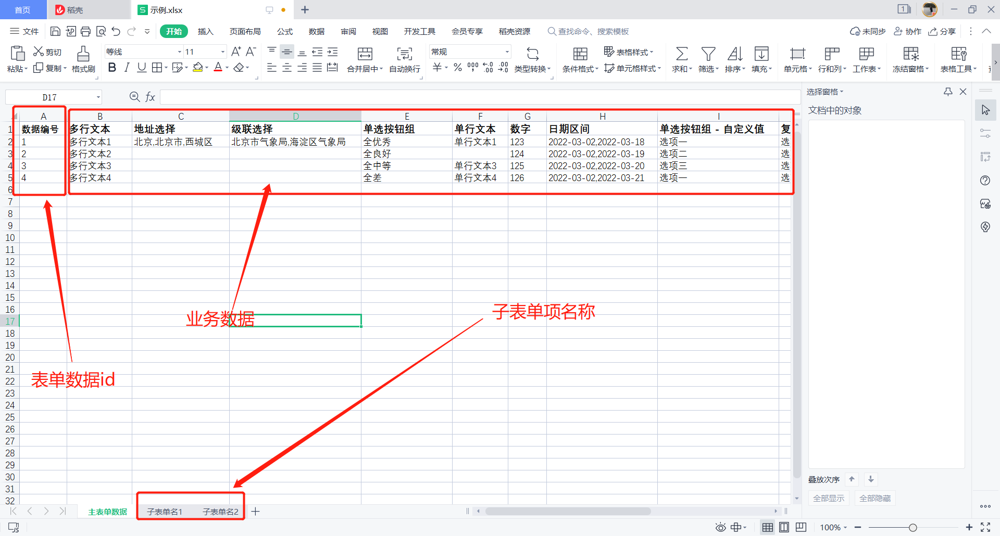

## excel 数据结构

- 第一个 sheet 页为主表单数据， 每一行代表一条表单数据，其他 sheet 页为子表单数据页。
- 第一个 sheet 页的第一列必须是数据的编号，此编号必须是唯一的。
- 子表单数据 sheet 页的名称必须与表单设计中的子表单项名称一致。
- 子表单数据 sheet 页的第一列必须是所属主表单的编号，用于表示该条子表单数据属于哪一条主表单数据。

主表单数据 sheet 页：

子表单数据 sheet 页：

## 导入数据格式

**注意：** 以下用于分割数据的逗号都是英文逗号 => `,`

- 日期区间：yyyy-mm-dd,yyyy-mm-dd               例如：2022-02-01,2022-03-03
- 地址选择：省/自治区/直辖市,市,区/县             例如：北京,北京市,西城区
- 级联选择：选项一,选项二,选项三....              例如：北京市气象局,海淀区气象局
- 复选框组：选项一,选项二,选项三....              例如：选项三,选项一
- 多选下拉选择：选项一,选项二,选项三....              例如：选项三,选项一
- 其他组件：直接填写值   例如：
  - 单选按钮组：选项一
  - 单行文本框：你好
  - ......

## excel 数据限制

不支持导入`用户选择`、`部门选择`、`附件上传`、`意见`、`序号`组件的数据导入。