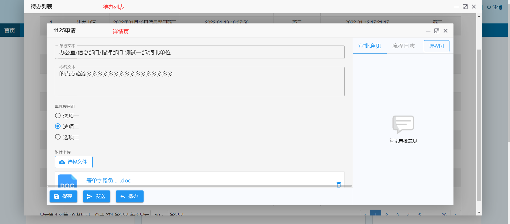
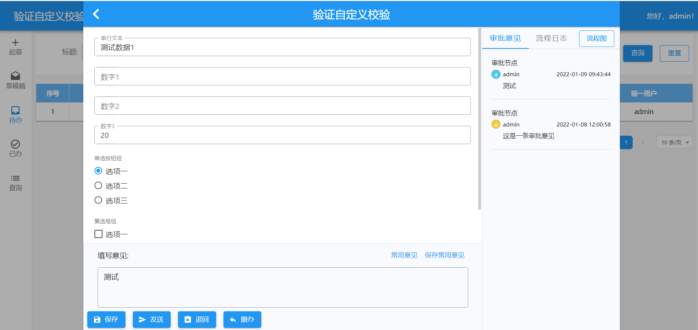
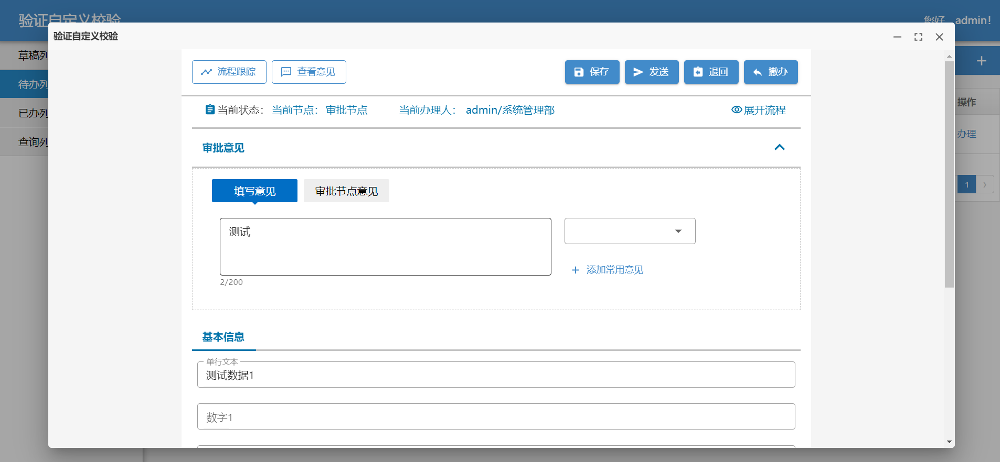

智能表单目前提供三种方式的待办页面集成：

- 直接从待办列表使用弹窗的方式打开详情页，关闭详情页，页面停留在待办列表
- 从待办列表打开单应用（或单表单）首页上的弹窗详情页，关闭详情页，页面停留在单应用首页
- 从待办列表打开只包含待办详情页的新页面，关闭新页面，回到待办列表页面

下面我们分别详细介绍各种方式的集成方法。

:::info
此文档以项目组直接从工作流查询待办为例进行说明。如果待办列表不是从工作流引擎直接获取，而是由项目组自己托管，则需要按照[接收流程待办数据扩展接口](config-workflow#urlsync-workflow-items-url-配置项)进行配置。
:::

## 直接从待办列表使用弹窗的方式打开详情页

### 集成方式

首先，判断数据中的`waitdourl`(对应`FLOW_WRITE`表中的`WAITDOURL`字段)是否以`/intellisense-form/`开头以此来判断此数据是否为智能表单生成的数据。如果是则需要拼接为如下的`url`来打开待办详情页。

`http://<网关ip:ports>/intellisense-form/form-app/:formId/detail?workItemId=${流程待办id}&modal=false&recordId=${表单数据id}`

参数说明：

- `<网关ip:ports>` -- 能访问智能表单的地址
- `formId` -- 对应`FLOW_WRITE`表中的`FORMURL`字段
- `recordId` -- 对应`FLOW_WRITE`表中的`DOCID`字段
- `workItemId` -- 对应`FLOW_WRITE`表中的`ID`字段

### 集成效果



## 从待办列表打开单应用（或单表单）首页上的弹窗详情页

### 集成方式

首先，判断数据中的`waitdourl`(对应`FLOW_WRITE`表中的`WAITDOURL`字段)是否以`/intellisense-form/`开头以此来判断此数据是否为智能表单生成的数据。如果是则需要拼接为如下的`url`来打开待办详情页。

`http://<网关ip:port>/intellisense-form/form-app/:formId/home/todo-list?recordId=${表单数据id}&workItemId=${流程待办id}#detail-page`。

其中`url`中的参数说明可参考上一章节中的参数说明。

### 集成效果

单表单首页打开详情：



单应用首页打开详情：



## 流程办理成功刷新待办列表

当我们在详情页处理完数据之后（比如发送、撤回、退回等），通常需要刷新待办列表。我们是以 window.postMessage()方法向业务系统发送消息，业务系统监听到该消息后认为操作成功，继而进行后续处理（比如关闭弹窗、刷新列表等）。示例代码如下：

```js
window.addEventListener(
  "message",
  function (event) {
    var data = event.data;
    if (data && JSON.parse(data).type === "sendSuccess") {
      // 根据各业务系统实际需求 处理后续操作
    }
  },
  false
);
```

### message 类型

业务系统可根据监听到的消息类型(type)，进行后续操作。智能表单涉及到的消息类型如下：

| 类型标识              | 描述         |
| --------------------- | ------------ |
| sendSuccess           | 发送成功     |
| backSuccess           | 退回成功     |
| backSuccess           | 退拟稿人成功 |
| endSuccess            | 办结成功     |
| takeBackSuccess       | 收回成功     |
| cancelBackSuccess     | 撤办成功     |
| regainWorkflowSuccess | 流程恢复成功 |
