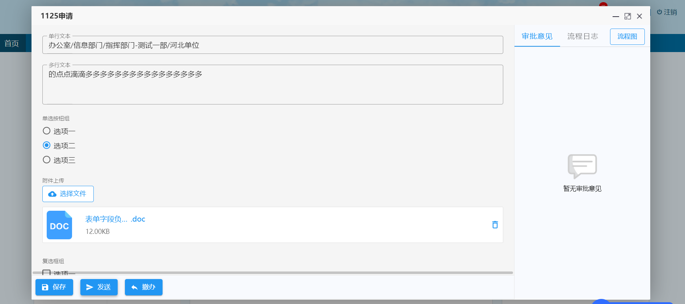

智能表单目前提供三种方式的待办页面集成：

- 直接从待办列表使用弹窗的方式打开详情页，关闭详情页，页面停留在待办列表
- 从待办列表打开单应用（或单表单）首页上的弹窗详情页，关闭详情页，页面停留在单应用首页
- 从待办列表打开只包含待办详情页的新页面，关闭新页面，回到待办列表页面

下面我们分别详细介绍各种方式的集成方法。

:::info
此文档以项目组直接从工作流查询待办为例进行说明。如果待办列表不是从工作流引擎直接获取，而是由项目组自己托管，则需要按照[接收流程待办数据扩展接口](config-workflow#urlsync-workflow-items-url-配置项)进行配置。
:::

## 直接从待办列表使用弹窗的方式打开详情页

### 集成方式

首先，判断数据中的`waitdourl`(对应`FLOW_WRITE`表中的`WAITDOURL`字段)是否以`/intellisense-form/`开头以此来判断此数据是否为智能表单生成的数据。如果是则需要拼接为如下的`url`来打开待办详情页。

`http://<网关ip:ports>/intellisense-form/form-app/:formId/detail?workItemId=${流程待办id}&modal=false&recordId=${表单数据id}`

参数说明：

- `<网关ip:ports>` -- 能访问智能表单的地址
- `formId` -- 对应`FLOW_WRITE`表中的`FORMURL`字段
- `recordId` -- 对应`FLOW_WRITE`表中的`DOCID`字段
- `workItemId` -- 对应`FLOW_WRITE`表中的`ID`字段

### 集成效果



## 从待办列表打开单应用（或单表单）首页上的弹窗详情页

### 集成方式

首先，判断数据中的`waitdourl`(对应`FLOW_WRITE`表中的`WAITDOURL`字段)是否以`/intellisense-form/`开头以此来判断此数据是否为智能表单生成的数据。如果是则需要拼接为如下的`url`来打开待办详情页。

`http://<网关ip:port>/intellisense-form/form-app/:formId/home/todo-list?recordId=${表单数据id}&workItemId=${流程待办id}#detail-page`。

其中`url`中的参数说明可参考上一章节中的参数说明。

### 集成效果

单表单首页打开详情：


单应用首页打开详情：


### 页面关闭

使用此种集成方式，如果想在流程处理完成后，直接关闭打开的新窗口，可以直接在打开窗口的 url 中添加`autoClose`参数，这样发送完成后，读秒关闭提示弹窗的同时会自动关闭此窗口。

`http://<网关ip:port>/intellisense-form/form-app/:formId/home/todo-list?recordId=${表单数据id}&workItemId=${流程待办id}&autoClose=true#detail-page`

## 流程办理成功刷新待办列表

### 非跨域模式集成

当我们在详情页处理完数据之后（比如发送、撤回、退回等），通常需要刷新待办列表。我们是以 window.postMessage()方法向业务系统发送消息，业务系统监听到该消息后认为操作成功，继而进行后续处理（比如关闭弹窗、刷新列表等）。示例代码如下：

```js
window.addEventListener(
  "message",
  function (event) {
    var data = event.data;
    if (data && JSON.parse(data).type === "sendSuccess") {
      // 根据各业务系统实际需求 处理后续操作
    }
  },
  false
);
```

#### message 类型

业务系统可根据监听到的消息类型(type)，进行后续操作。智能表单涉及到的消息类型如下：

| 类型标识              | 描述         |
| --------------------- | ------------ |
| sendSuccess           | 发送成功     |
| backSuccess           | 退回成功     |
| backSuccess           | 退拟稿人成功 |
| endSuccess            | 办结成功     |
| takeBackSuccess       | 收回成功     |
| cancelBackSuccess     | 撤办成功     |
| regainWorkflowSuccess | 流程恢复成功 |

### 跨域下办理完成刷新

1. 业务系统需要增加一个名称为 intellisense-form-todo-send-success-callback-page.html 文件。文件的代码如下：

```html
<!DOCTYPE html>
<html>
  <body>
    <script>
      var _id = window.location.search.match(/_id=([^&]+)/)[1];
      localStorage.removeItem("intellisense-form_" + _id);
    </script>
  </body>
</html>
```

2. 业务系统在使用 window.open('url') 方式打开智能表单待办页面时，需要在 url 中增加 successCallback=业务系统中 intellisense-form-todo-send-success-callback-page.html 访问路径?\_id=xxx 参数。并加 startMonitorRefresh 处理函数，示例代码如下：

```js
// 打开智能表单待办
function openTodo() {
  var _id = new Date().getTime() + "";
  // 打开智能表单待办页面
  var todoUrl =
    "http://192.168.81.8:8080/intellisense-form/5ef93c10c9327f0a02534c81/todo" +
    "?id=5f0274b9ec2eb2c3fcf868dc&workItemId=99be8abae74f4509adbd38544642dad7&" +
    "autoClose=true";
  var successCallback =
    "http://192.168.81.8:3003/1Micro-blog/intellisense-form-todo-send-success-callback-page.html?_id=" +
    _id;
  var todoWindow = window.open(
    todoUrl + "&successCallback=" + successCallback,
    "_blank",
    "width=1800,height=10000,top=100px,left=0px"
  );
  startMonitorRefresh(todoWindow, _id);
}

function startMonitorRefresh(todoWindow, _id) {
  // 打开待办同时 存储localStorage
  localStorage.setItem("intellisense-form_" + _id, "1");

  // 定时器监测localStorage 指定的localStorage item是否存在
  var timerId = setInterval(function () {
    var formTodoFlag = localStorage.getItem("intellisense-form_" + _id);
    // 指定的localStorage item 不存在 执行刷新相关操作
    if (!formTodoFlag) {
      clearInterval(timerId);
      // 业务系统处理刷新
      // 将以下语句替换成业务系统中刷新待办的代码
      console.log("刷新");
    }
  }, 300);
}

// 关闭页面清除localstorage
window.onunload = function () {
  var keyLen = localStorage.length; // 获取长度
  for (var i = 0; i < keyLen; i++) {
    // 获取key 索引从0开始
    var key = localStorage.key(i);
    if (key.startsWith("intellisense-form_")) {
      localStorage.removeItem(key);
    }
  }
};
```

:::info 温馨提示
intellisense-form-todo-send-success-callback-page.html 文件名可以更改，只需和 successCallback 中的 html 文件名保持一致即可
:::
